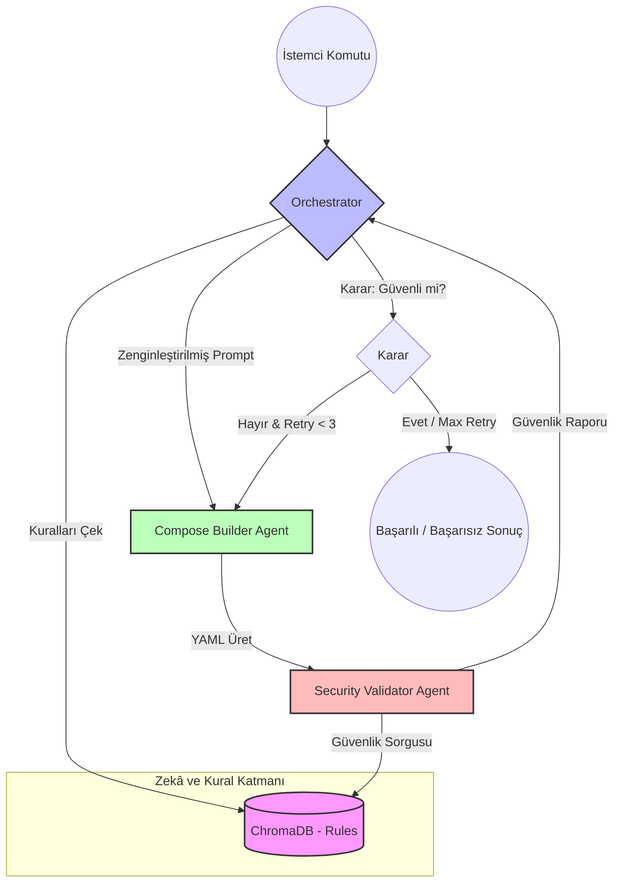

# DockAgents 

**DockAgents**, doğal dil komutlarını kullanarak üretim ortamına hazır (production-ready) ve güvenliği önceliklendiren Docker Compose yapılandırmaları oluşturan AI tabanlı bir orkestrasyon sistemidir. 

Sistem, **LangGraph.js** kullanarak geliştirilmiş sofistike bir çoklu-ajan (multi-agent) iş akışı üzerinde çalışır. Sadece bir YAML dosyası üretmekle kalmaz, aynı zamanda bu dosyayı güvenlik standartlarına göre denetler ve hataları gidermek için kendi kendine iyileştirme (self-healing) döngülerini çalıştırır.

---

## Mimari ve Çalışma Mantığı

DockAgents, "Chain of Thought" prensibini bir adım öteye taşıyarak ajanlar arası bir geri bildirim döngüsü kurar.

### İş Akışı Diyagramı



### Ajan Sorumlulukları

| Ajan | Amacı | Sorumluluğu |
| :--- | :--- | :--- |
| **Orchestrator** | Karar Verici | Kullanıcı talebini alır, VectorDB'den kuralları çeker, güvenlik raporlarını değerlendirir ve döngüyü yönetir. |
| **Compose Builder** | Master YAML Mimarı | En iyi Docker pratiklerini kullanarak `docker-compose.yaml` dosyasını yazar. |
| **Security Validator** | Güvenlik Denetleyicisi | Üretilen YAML'ı potansiyel zafiyetlere (root yetkileri, hardcoded sırlar vb.) karşı denetler. |

---

## Teknolojik Altyapı

- **Framework:** Node.js (Express.js)
- **AI Orchestration:** LangGraph.js & LangChain.js
- **LLM:** OpenAI GPT-4o
- **Vector Database:** ChromaDB (En iyi pratikler ve güvenlik kuralları için)
- **Logger:** Winston (Yapılandırılmış log yönetimi)

---

## Kurulum ve Çalıştırma

### Ön Gereksinimler
- Node.js (v18+)
- Docker (ChromaDB için)
- OpenAI API Anahtarı

### 1. Projeyi Klonlayın ve Bağımlılıkları Yükleyin
```bash
cd DockAgents
npm install
```

### 2. Ortam Değişkenlerini Yapılandırın
`.env.example` dosyasını `.env` olarak kopyalayın ve gerekli bilgileri girin:
```bash
cp .env.example .env
```
`.env` içeriği örneği:
```env
OPENAI_API_KEY=sk-....
OPENAI_MODEL=gpt-4o
MAX_RETRY_LOOPS=3
PORT=8000
```

### 3. Altyapıyı Başlatın (ChromaDB)
Uygulamanın çalışması için ChromaDB'nin ayakta olması gerekir:
```bash
docker compose up -d
```

### 4. Uygulamayı Başlatın
```bash
npm run dev
```

---

## 📡 API Kullanımı

### Chat Endpoint
Sisteme komut göndermek için kullanılan ana endpoint'tir.

**İstek:**
`POST /chat`

```json
{
  "prompt": "WordPress, MySQL ve Redis içeren, kaynak limitleri belirlenmiş bir yapı kur."
}
```

**Yanıt:**
```json
{
  "compose_yaml": "version: '3.8'\nservices:...",
  "security_report": "[JSON structured report]",
  "iterations": 2,
  "status": "success"
}
```

---

## Proje Yapısı

```
DockAgents/
├── src/
│   ├── agents/          # Ajan mantığı (Base, Orchestrator, Builder, Validator)
│   ├── api/             # Express route ve API tanımları
│   ├── core/            # Config, LLM factory, Logger gibi temel bileşenler
│   ├── services/        # ChromaDB ve diğer harici servisler
│   ├── workflow/        # LangGraph iş akışı tanımı
│   └── index.js         # Uygulama giriş noktası
├── docker-compose.yml   # ChromaDB bağımlılığı için
├── package.json
└── README.md
```

---

## Tasarım Prensipleri

Sistem geliştirilirken aşağıdaki yazılım prensiplerine sadık kalınmıştır:
- **SOLID Prensipleri:** Her ajan tek bir sorumluluğa sahiptir (SRP) ve BaseAgent üzerinden genişletilebilir (OCP).
- **DRY (Don't Repeat Yourself):** LLM istemcileri, loglama ve servis yönetimi merkezi bir noktada toplanmıştır.
- **Self-Healing AI:** Hata raporlarını okuyup kendi yazdığı kodun hatalarını düzelten döngüsel bir yapı kurulmuştur.


